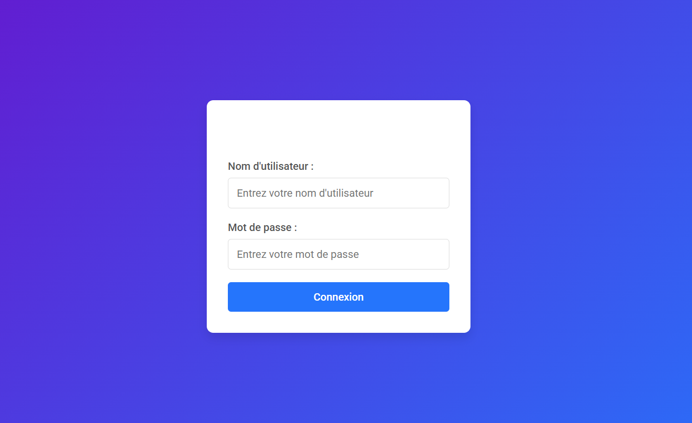
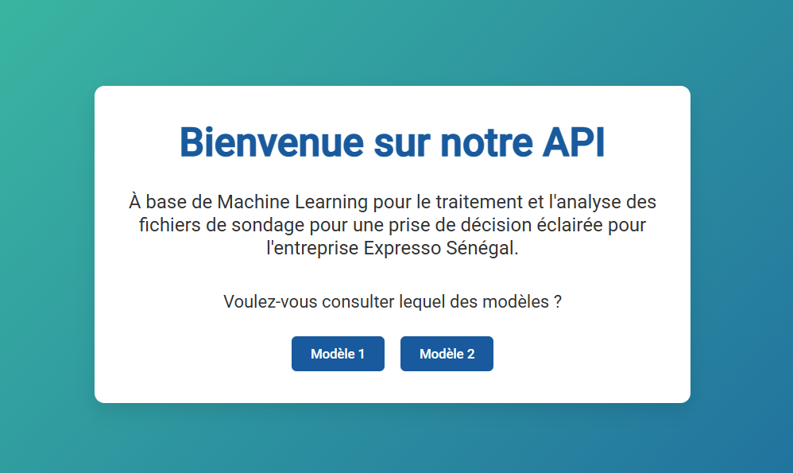
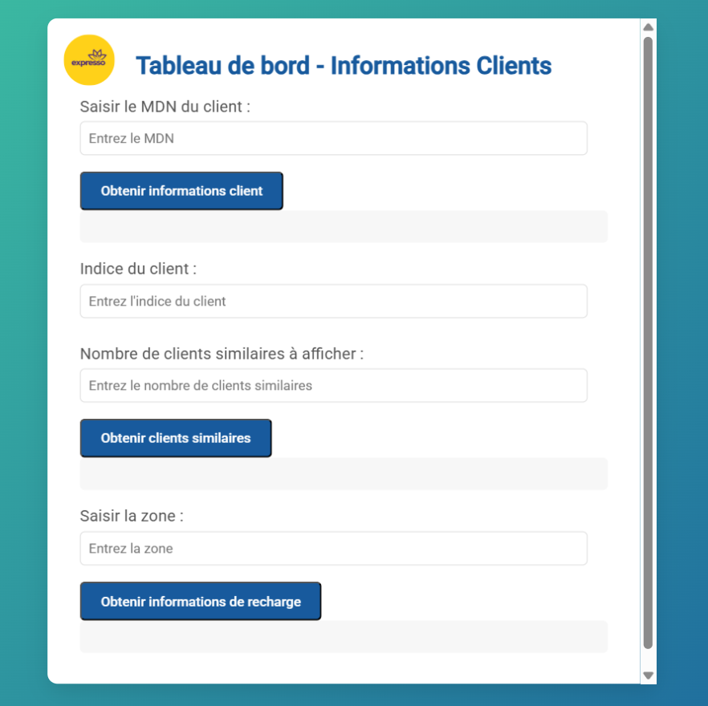
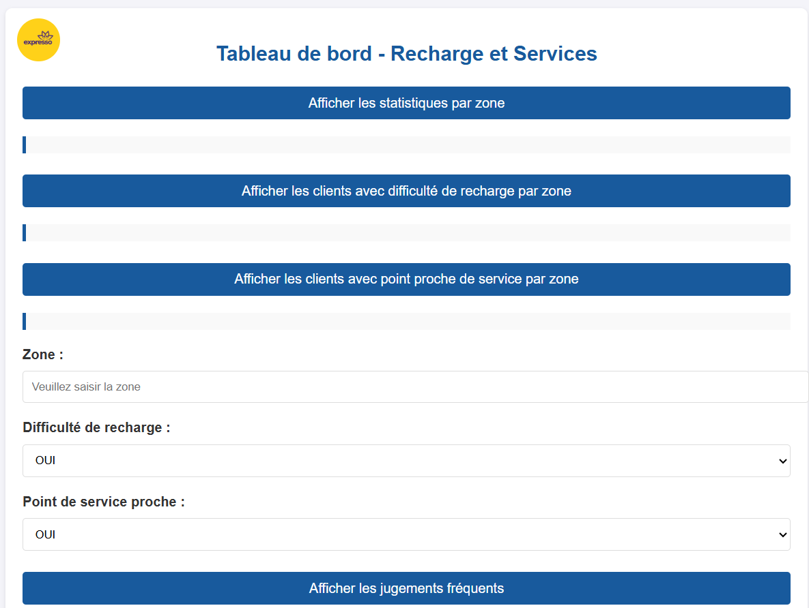

<p align="center">
    
</p>

# Système de Gestion de Sondages et Analyse Prédictive par Machine Learning

### Présentation du Projet
Ce projet, développé dans le cadre de travaux de recherche en Ingénierie des Données et Intelligence Artificielle, consiste en une API REST robuste conçue pour automatiser le traitement et l'analyse de sondages. Au-delà de la collecte de données, la plateforme intègre des modèles d'apprentissage automatique pour transformer des données brutes en indicateurs stratégiques exploitables.

---

## Architecture Visuelle et Modules

### Accès et Sécurisation
Le système dispose d'une interface d'authentification sécurisée garantissant l'intégrité des données collectées et la restriction des accès aux seuls administrateurs autorisés.
<p align="center">
    
</p>

### Tableau de Bord Principal (Accueil)
L'interface d'accueil centralise la gestion des enquêtes, permettant une surveillance en temps réel des flux de données entrants et des métriques de complétion des sondages.
<p align="center">
    
</p>

### Analyse par Segmentation et Clustering (Modèle 1)
Ce module analytique exploite des algorithmes de clustering pour regrouper les répondants par profils de comportement homogènes, facilitant ainsi l'identification de segments spécifiques dans les données.
<p align="center">
    
</p>

### Moteur de Recommandation Prédictive (Modèle 2)
Le second module utilise des modèles d'apprentissage supervisé pour générer des recommandations automatiques basées sur les corrélations extraites, orientant ainsi la prise de décision stratégique.
<p align="center">
    
</p>

---

## Spécifications Fonctionnelles

1. **Ingénierie des Données** : Nettoyage, normalisation et prétraitement automatisé des données de sondage.
2. **Segmentation Avancée** : Mise en œuvre d'algorithmes de clustering (K-Means, DBSCAN) pour l'analyse comportementale.
3. **Système de Recommandation** : Modèles prédictifs pour l'analyse des tendances et la fourniture de préconisations automatiques.
4. **Architecture API RESTful** : Interface modulaire développée pour une intégration fluide avec des systèmes tiers.

## Spécifications Techniques

- **Backend** : Python 3.10+, Framework Flask.
- **Data Science** : Scikit-learn, Pandas, NumPy, Scipy.
- **Visualisation** : Matplotlib, Seaborn, Chart.js.
- **Persistance** : MySQL / SQLite.
- **Modélisation** : Sérialisation des modèles via Pickle ou Joblib.

## Installation et Configuration

1. **Clonage du dépôt** :
   ```bash
   git clone https://github.com/lassana99/api-gestion-sondages-ml.git